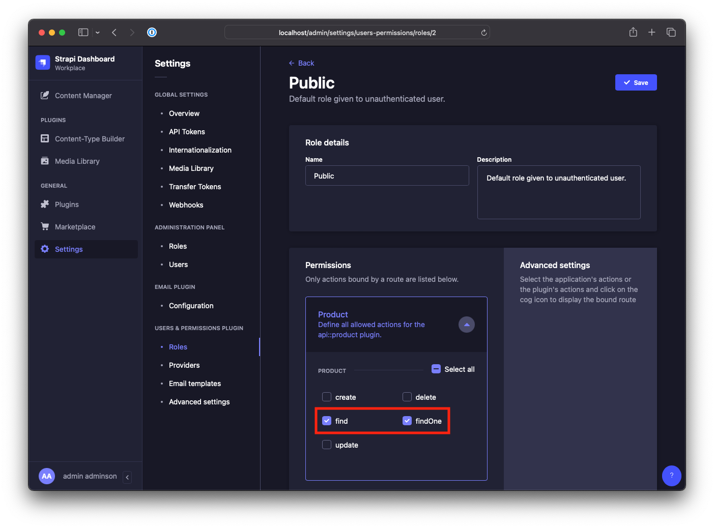

# Nuxt 3 & Strapi 4 in Docker 

## Installation
```bash
git clone git@github.com:tarikkavaz/NuxtStrapiDocker.git
cd NuxtStrapiDocker
cp backend/.env.example backend/.env
docker-compose up
```
## Setup

1. Open Strapi Admin [http://localhost/admin](http://localhost/admin) and create an account
2. Under Users & Permissions open the [Roles Page](http://localhost/admin/settings/users-permissions/roles/2)
3. Select Public and give your Collection Type `find` and `findOne` permitions.

4. Add some content in [Content Manager](http://localhost/admin/content-manager). Don't forget to **Publish!**

## Project links
- Site [http://localhost/](http://localhost/) 
- API [http://localhost/api](http://localhost/api)
